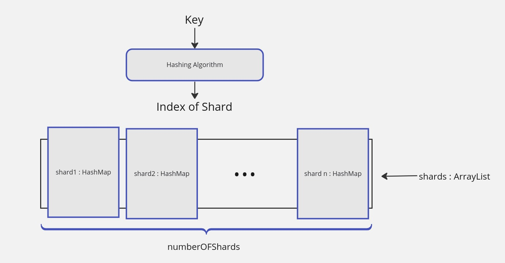

# ShardedHashmap Application

## Project Description

SharedHashmap Application is a Spring Boot application developed in Java. The main purpose of this application is to implements a simple HTTP API that mimics the functionalities of a HashMap. The application is designed to be sharded, meaning that the data is partitioned across multiple servers to improve performance and scalability.
#### <a href="https://github.com/missingsemester-ma/projects/blob/main/shardedhmap.md">Problem statement link</a>

## Sharding Concept

Sharding is a type of database partitioning that separates very large databases into smaller, faster, more easily managed parts called data shards. The word `shard` means a small part of a whole. Sharding is used in databases to improve performance and make it easier to manage and scale your application.

Each shard is held on a separate database server instance, to spread load and reduce the risk of a single point of failure. Sharding can be done in many different ways, including `range partitioning, list partitioning, and hash partitioning`.

## Application Design



The design of the project based on a distributed system architecture. The application is designed to be sharded, meaning that the data is partitioned across multiple servers. Here is the main components of the design : 

- **Hashing Strategy** : We used `hashed sharding`, while the key is hashed and the hash value is used to determine which shard the key-value pair should be stored in. It's based on Java's built-in `hashCode()` method for the String class, which computes a hash value for the input string.


- **Shards/Database Servers** : To simplify the design, we used a list of `HashMap<String, String>` to represent the shards. Each shard is a `HashMap` that stores key-value pairs. In a real-world scenario, each shard would be a separate database server instance. In this application we have defined the number of shards in the `application.properties` file at the attribute `app.numberOfShards`.


- **API Features** : The application provides the following features through its HTTP API:

  - **POST** `/api` : Add a key-value pair to the appropriate shard.
  - **GET** `/api/{key}` : Retrieve the value associated with the given key from the appropriate shard.
  - **DELETE** `/api/{key}` : Delete the key-value pair associated with the given key from the appropriate shard.
  
## Implementation Method

In this project, we have implemented sharding using a custom sharding strategy. This method involves using an interface `IShardingStrategy` that has a method `getShardForKey()`. This method takes a key as input and returns the index of the shard that the key-value pair should be stored in.

The `HashMapService` class uses this sharding strategy to determine which shard to use for a given key. It maintains a list of shards, each of which is a `HashMap<String, String>`. When a key-value pair is added, the `add()` method of the `HashMapService` class uses the `getShardForKey()` method of the sharding strategy to determine which shard to add the key-value pair to. Similarly, the `retrieve()` and `delete()` methods use the `getShardForKey()` method to determine which shard to retrieve a value from or delete a key from, respectively.

The benefits of using this sharding scheme include:

- Improved performance: By distributing the data across multiple shards, we can reduce the load on each shard and improve the overall performance of the application.
- Scalability: As the amount of data increases, we can easily add more shards to accommodate the additional data.
- Flexibility: By using an interface for the sharding strategy, we can easily switch to a different sharding scheme if needed. All we need to do is implement the `IShardingStrategy` interface with the new sharding scheme.

## Tradeoffs
We have used a HashMap list based database server to represent the shards because of some reasons :

- **Simplicity** : A list of hashmaps is a simple data structure that is easy to understand and implement. It doesn't require any additional libraries or dependencies, and it's built into most programming languages, including Java. As a result, we will implement a simple sharding algorithm without the need for complex database systems.
- **Flexibility** : A list of hashmaps can easily be sharded, as we've done in our project. Each hashmap in the list can act as a separate shard, and keys can be distributed among the shards using a hashing function. This allows for easy scaling of the database.
- **In-memory storage** : A list of hashmaps is stored in memory, which allows for faster access times compared to disk-based storage.
- **Colision Handling** : The hashmap has a built-in mechanism for handling collisions, which can occur when two keys hash to the same value. This makes it easy to store and retrieve key-value pairs without worrying about collisions.

However, this also means that the data is not persistent and will be lost if the application is stopped or crashes.

## Building and Running the Application
***Method 1 : Using IntelliJ IDEA IDE***

The simplest way to build and run the project is to use IntelliJ IDEA IDE or any other IDE that supports Java and Maven.

- Clone the repository to your local machine :
```bash
git clone
```
- Open the project in IntelliJ IDEA.
- Download the dependencies by clicking on the `Reimport` button in the Maven tool window or by navigating to the `pom.xml` file and clicking on the `Import Changes` button.
- Run the project by clicking on the green play button in the top right corner of the IDE.
- The project will start, and you can access the API by sending HTTP requests to `http://localhost:8080/api`.

***Method 2 : Using the Command Line***

To build and run this project, you need to have the following dependencies installed on your host:

- Java 21
- Maven last version
- Spring Boot 3.2.4

Once you have these dependencies installed, you can build the project by running the following command in the root directory of the project:

```bash
mvn clean install
```
his command will build the project and create a JAR file in the target directory.

To run the project, navigate to the target directory and run the following command:
    
```bash
java -jar ShardedHashmapApplication.jar
```
This command will start the Spring Boot application. 

### Accessing the API
You can access the API by sending HTTP requests to `http://localhost:8080/api` using `postman` or simply `curl` tool from the terminal.
### Usage Examples
Here are some examples of how to use the API:

- **Adding Data**
```bash
curl -X POST -H "Content-Type: application/json" -d '{"key":"myKey", "value":"myValue"}' 'http://localhost:8080/api'
```
- **Retrieving Data**
```bash
curl -X GET 'http://localhost:8080/api/myKey'
```
- **Deleting Data**
```bash
curl -X DELETE 'http://localhost:8080/api/myKey'
```

<br></br>
### Contact
If you have any questions or suggestions, feel free to contact me or put a comment.